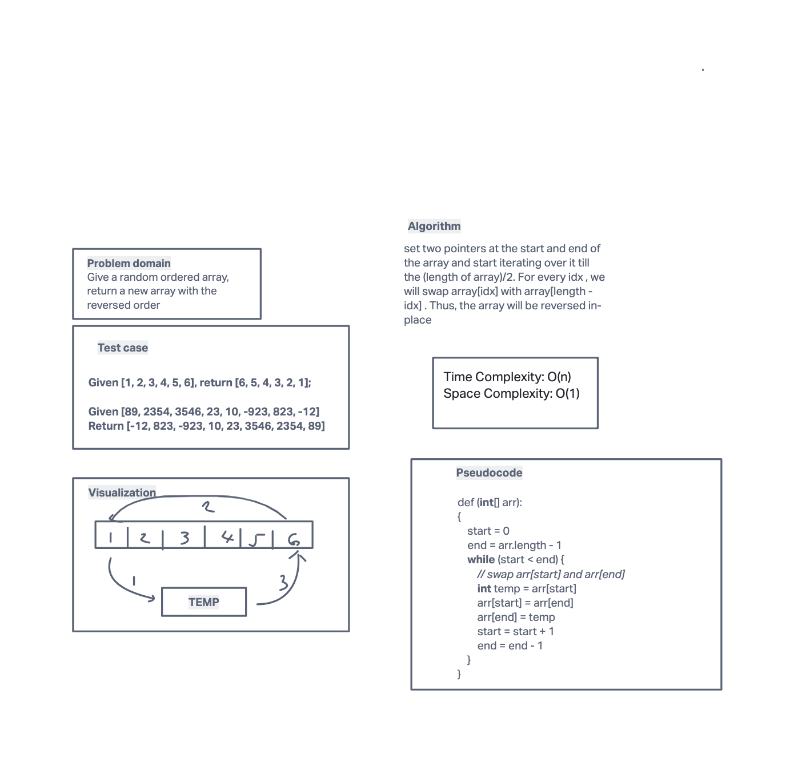

# Reverse an Array
Write a function called reverseArray which takes an array as an argument.
Without utilizing any of the built-in methods available to your language,
return an array with elements in reversed order.

## Whiteboard Process


## Approach & Efficiency

Solution Steps

Place the two pointers (let start and end) at the start and end of the array.
Swap arr[start] and arr[end]
Increment start and decrement end with 1
If start reached to the value length/2 or start ≥ end, then terminate otherwise repeat from step 2.

```
Big O space: O(1)
Big O time: O(n)
```

## Pseudocode
```
def rvereseArray(int[] arr):
{
    start = 0
    end = arr.length - 1
    while (start < end) {
        // swap arr[start] and arr[end]
        int temp = arr[start]
        arr[start] = arr[end]
        arr[end] = temp
        start = start + 1
        end = end - 1
    }
}
```


