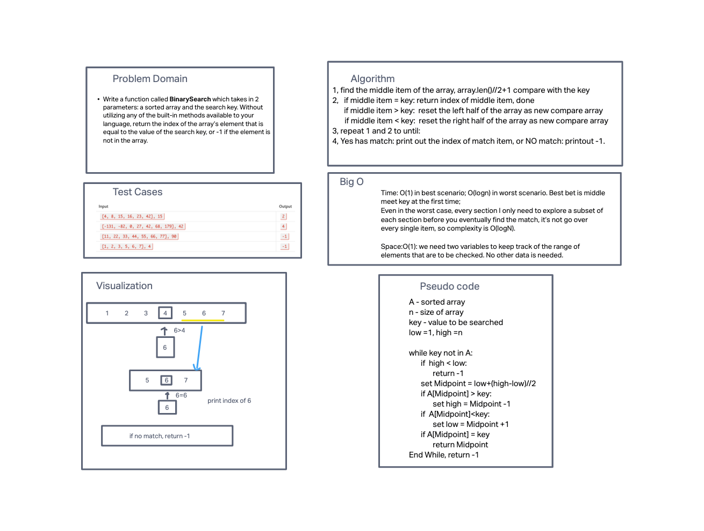

# Binary Search
<!-- Description of the challenge -->
- Binary search in a sorted 1D array
- Write a function called BinarySearch which takes in 2 parameters:
a sorted array and the search key. Without utilizing any of the built-in methods
available to your language, return the index of the array’s element that is equal
to the value of the search key, or -1 if the element is not in the array.

## Whiteboard Process
<!-- Embedded whiteboard image -->

## Approach & Efficiency
<!-- What approach did you take? Discuss Why. What is the Big O space/time for this approach? -->

### Big O
Time: O(1) in best scenario; O(logn) in worst scenario. Best bet is middle meet key at the first time;

Even in the worst case, every section I only need to explore a subset of each section before you eventually find the match, it’s not go over every single item, so complexity is O(logN).

Space:O(1): we need two variables to keep track of the range of elements that are to be checked. No other data is needed.
