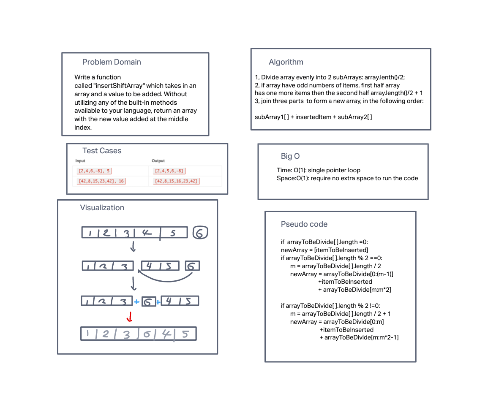

# Insert to Middle of an Array
<!-- Description of the challenge -->
Write a function called "insertShiftArray" which takes in an array and a value to be added.
Without utilizing any of the built-in methods available to your language,
return an array with the new value added at the middle index.

## Whiteboard Process
<!-- Embedded whiteboard image -->

## Approach & Efficiency
<!-- What approach did you take? Discuss Why. What is the Big O space/time for this approach? -->
Basically I divide the original array evenly into two part if array has even numbers of items
or have the first half have one more item than the second half if the array have odd numbers of items

then I join the item to be inserted in the middle of the two seperated arrays.
using concarnation method.

### Big O
This algorithm requires single pointer looping, so efficiency wise very good, big O is O(1) for both time and space.
