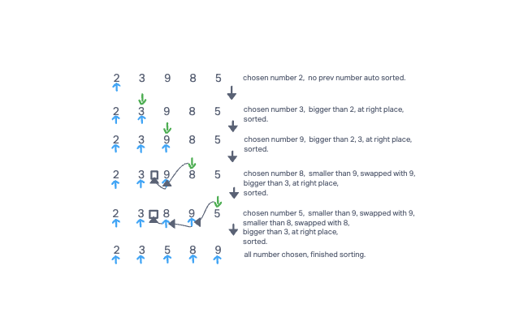

# Challenge Summary
Given an array that contains a list of random ordered numbers. sort them using insertion sort method.
Insertion sort is a sorting algorithm that places an unsorted element at it's right place in each
iteration, until to the very end that every number is at its right place.


## Tracing 



## Approach & Efficiency
- space complexity: O(1): only need 1 space to hold the chosen number during the sorting, therefore O(1).

- time complexity: O(N^2): worst scenario is numbers are in a decreasing order. you have to compare n times for 
one chosen number, n numbers need n*n, so complexity is O(N^2)


## Solution

```angular2html
insertionSort(int[] arr)

    FOR i = 1 to arr.length

      int j <-- i - 1
      int temp <-- arr[i]

      WHILE j >= 0 AND temp < arr[j]
        arr[j + 1] <-- arr[j]
        j <-- j - 1

      arr[j + 1] <-- temp
```

