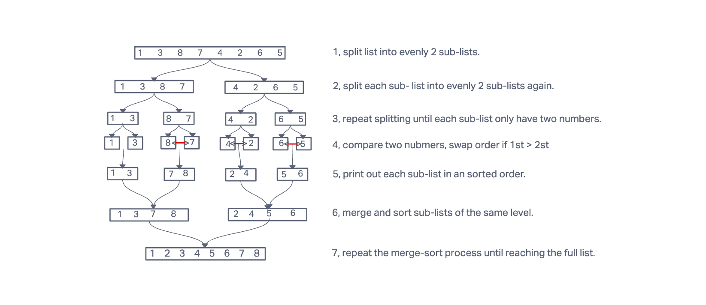

<div align="center">


# Merger Sort Implemetation
Given an array of random ordered numbers. sort those numbers to make them increasingly ordered.
we will be using the merge sort method.
merger sort uses divide and conquer technique that divide my_list into evenly half my_lists; and recursively split
 until sub-my_lists only have two items, and then start the sort and merger and repeatedly use same unit steps until reach the full my_list.


## Tracing steps

</div>

## Solution
we use merge sort algorithms. Pseudocode comes from assignment.
```
ALGORITHM Mergesort(arr)
    DECLARE n <-- arr.length

    if n > 1
      DECLARE mid <-- n/2
      DECLARE left <-- arr[0...mid]
      DECLARE right <-- arr[mid...n]
      // sort the left side
      Mergesort(left)
      // sort the right side
      Mergesort(right)
      // merge the sorted left and right sides together
      Merge(left, right, arr)

ALGORITHM Merge(left, right, arr)
    DECLARE i <-- 0
    DECLARE j <-- 0
    DECLARE k <-- 0

    while i < left.length && j < right.length
        if left[i] <= right[j]
            arr[k] <-- left[i]
            i <-- i + 1
        else
            arr[k] <-- right[j]
            j <-- j + 1

        k <-- k + 1

    if i = left.length
       set remaining entries in arr to remaining values in right
    else
       set remaining entries in arr to remaining values in left
```
## Workable Python code
```requirements.txt
def merge_sort(my_list):

    if len(my_list) > 1:
        mid = len(my_list) // 2
        left = my_list[:mid]
        right = my_list[mid:]

        merge_sort(left)
        merge_sort(right)
        merge(left, right, my_list)
    return my_list


def merge(left, right, my_list):
    i = j = k = 0

    while i < len(left) and j < len(right):
        if left[i] <= right[j]:
            my_list[k] = left[i]
            i += 1
        else:
            my_list[k] = right[j]
            j += 1
        k += 1

    if i == len(left):
        while j < len(right):
            my_list[k] = right[j]
            j += 1
            k += 1
    else:
        while i < len(left):
            my_list[k] = left[i]
            i += 1
            k += 1
```
<div align="center">

## Approach & Efficiency
- Time complexity: my_list will be divided into a max of Log(N) parts, merge sub-my_lists takes O(N)
time. Therefore, the time complexity is O(NlogN).
- Space complexity: my_list take N space to hold all sub-my_lists during merge and sort. 
therefore, the space complexity is O(N).
