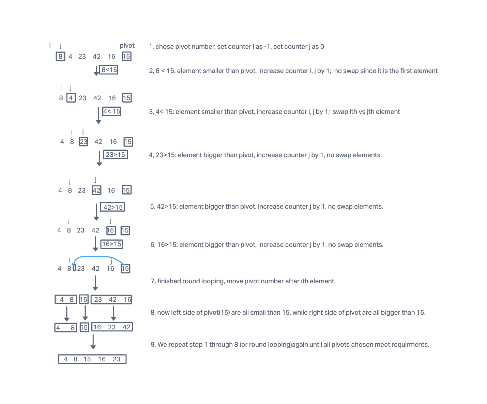

# Challenge Summary
- Given an array of random ordered numbers. sort those numbers to make them increasingly ordered.
- Use quick sort method.
- quick sort uses divide and conquer technique by picking pivot numbers and do compare and swap. 
List then is divided by pivot left and pivot right so that all left numbers are smaller than pivot and all right numbers
are bigger than pivot. recursively this steps until 'pivot' is enough to order all numbers in the list.
 until sub-my_lists only have two items, and then start the sort and merger and repeatedly use same unit steps until reach the full my_list.


## Tracing steps


## Approach & Efficiency
- Time complexity: list will be divided into a max of Log(N) parts, merge sub-my_lists takes O(N)
time. Therefore, the time complexity is O(NlogN).
- Space complexity: list take N space to hold all sub-lists during merge and sort. 
therefore, the space complexity is O(N).

## Solution
we use quick sort algorithms. Pseudocode comes from assignment.
```
ALGORITHM QuickSort(arr, left, right)
    if left < right
        // Partition the array by setting the position of the pivot value
        DEFINE position <-- Partition(arr, left, right)
        // Sort the left
        QuickSort(arr, left, position - 1)
        // Sort the right
        QuickSort(arr, position + 1, right)

ALGORITHM Partition(arr, left, right)
    // set a pivot value as a point of reference
    DEFINE pivot <-- arr[right]
    // create a variable to track the largest index of numbers lower than the defined pivot
    DEFINE low <-- left - 1
    for i <- left to right do
        if arr[i] <= pivot
            low++
            Swap(arr, i, low)

     // place the value of the pivot location in the middle.
     // all numbers smaller than the pivot are on the left, larger on the right.
     Swap(arr, right, low + 1)
    // return the pivot index point
     return low + 1

ALGORITHM Swap(arr, i, low)
    DEFINE temp;
    temp <-- arr[i]
    arr[i] <-- arr[low]
    arr[low] <-- temp
```

